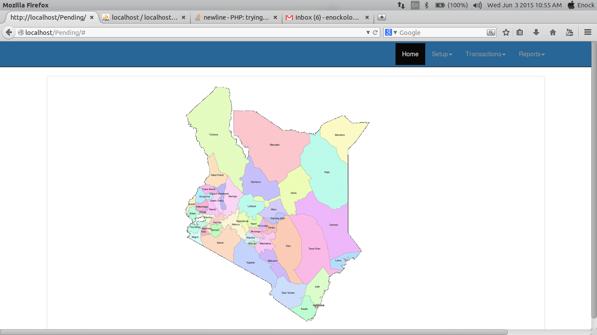

User guide
===========

Introduction
------------
MSH/HCSM is a key member of the Malaria drug management subcommittee, which is involved in the stockstatus monitoring 
of Malaria commodities both at the National and County levels.

On a monthly basis, the Malaria Control Unit, drug management committee meets to review the stock status ofmalaria commodities 
in the country, by analyzing data from various sources including:
	#. Facility and County Level Stock Data from DHIS.
	#. National Level Stock Status data from the Supply Chain Agencies (KEMSA).
	#. Pipeline information based on incoming shipments per funding agency.

This data is aggregated and analyzed for the different malaria commodities and a 2 pager report generated that
indicates to management, the months stock status and pipeline monitoring of Malaria commodities. Currently
MCU uses an excel based tool to generate this information. The current requirement is to amend and enhance
the current 2 pager tool to accommodate additional requirements including representation of Central and
county level data for Malaria commodities, and to color code the different pending shipments based on the
timelines for delivery. This request makes the current tool being used to develop the 2 pager report redundant
as it will not meet the requirements of the Malaria control unit and the donor, hence the need to develop a new
tool.

.. _`DHIS2`: https://www.dhis2.org/

Getting started
---------------
Purpose of this project is to create a stock status management tool that analyzes data from various sources including:

#. Facility and County Level Stock Data from DHIS.
#. National Level Stock Status data from the Supply Chain Agencies (KEMSA).
#. Pipeline information based on incoming shipments per funding agency.

System requirements
~~~~~~~~~~~~~~~~~~~
Chrome/Chromium browser is recommended for the application. This is because of the javascript used in the application wil be able to load faster.

Login roles to DHIS2 are also required inorder to access the application.

`Authentication`_ is the process by which clients send login credentials over the HTTP to a web server. The request is 
associated with a specific user, while `authorization`_ determines if the user has permission to perform
the requested operation.

.. _`Authentication`: https://www.dhis2.org/doc/snapshot/en/developer/html/ch01s02.html
.. _`authorization`: https://www.dhis2.org/doc/snapshot/en/developer/html/ch01s02.html

Session Authentication
~~~~~~~~~~~~~~~~~~~~~~~~
Logging in
+++++++++++++
You have to loggin to the Stock management tool to access most of its functionality.
 The payload should be similar to the example below:

.. code-block:: javascript

    {
        "username": "username",
        "password": "password"
    }

.. note::

    A successiful login will lead you to using the application.

Here is the login page:

 	
	.. figure:: images/homepage.jpg

Logging out
++++++++++++++
.. note::
You can logout after using the tool.

Here is the logout panel

A successful logout will bring up a  success
message similar to the one below:

.. code-block:: javascript

    {
        "success": "Successfully logged out."
    }

    

Setting up users and permissions 
-------------------------------------------

Updating an existing role
++++++++++++++++++++++++++++

``PUT`` or ``PATCH`` to a group **detail URL** e.g ``/api/users/groups/1/``.

For example, to take away from the example role the "Can change email address"
permission, the following ``PATCH`` request should be sent:

.. code-block:: javascript

    {
        "permissions": [
            {
                "id": 61,
                "name": "Can add email address",
                "codename": "add_emailaddress"
            }
        ]
    }

A similar approach will be followed to add permissions.

A successful operation will get back a ``HTTP 200 OK`` status.

.. note::

    **Permissions will always be overwritten** when you perform an update.

User management
-------------------
User registration ( sign up )
~~~~~~~~~~~~~~~~~~~~~~~~~~~~~~~~~

 
Updating user details
~~~~~~~~~~~~~~~~~~~~~~~~~~~~~~~
Every writable attribute of a user record can be ``PATCH``ed. For example,
to inactivate or retire a user, ``PATCH`` the user's ( detail ) record and set
``is_active`` to ``false``.

For example: if the detail record for the user we registered above
( ``likeforreal`` ) is to be found at ``/api/users/9/``, the user can be
inactivated by ``PATCH`` ing ``/api/users/9/`` with:

.. code-block:: javascript

    {
        "active": false
    }

.. note::

    The same general approach can be used for any other flag e.g
    ``is_superuser``.

Password changes
~~~~~~~~~~~~~~~~~~~
The password of the **logged in user** can be changed by making a ``POST`` to
``/api/rest-auth/password/change/`` a payload similar to this example:

.. code-block:: javascript

    {
        "old_password": "oldanddonewith",
        "new_password1": "newhotness",
        "new_password2": "newhotness"
    }

Tasks
-------------------
Get reports
~~~~~~~~~~~~~~~~~~~~~~~~~~~~~~~~~
these are reports

Download the Documentation(PDF)
~~~~~~~~~~~~~~~~~~~~~~~~~~~~~~~~~
Task3
~~~~~~~~~~~~~~~~~~~~~~~~~~~~~~~~~

.. note::

    A future version of this server may add support for social authentication
    e.g login via Facebook, Twitter or Google accounts.

.. toctree::
    :maxdepth: 2
